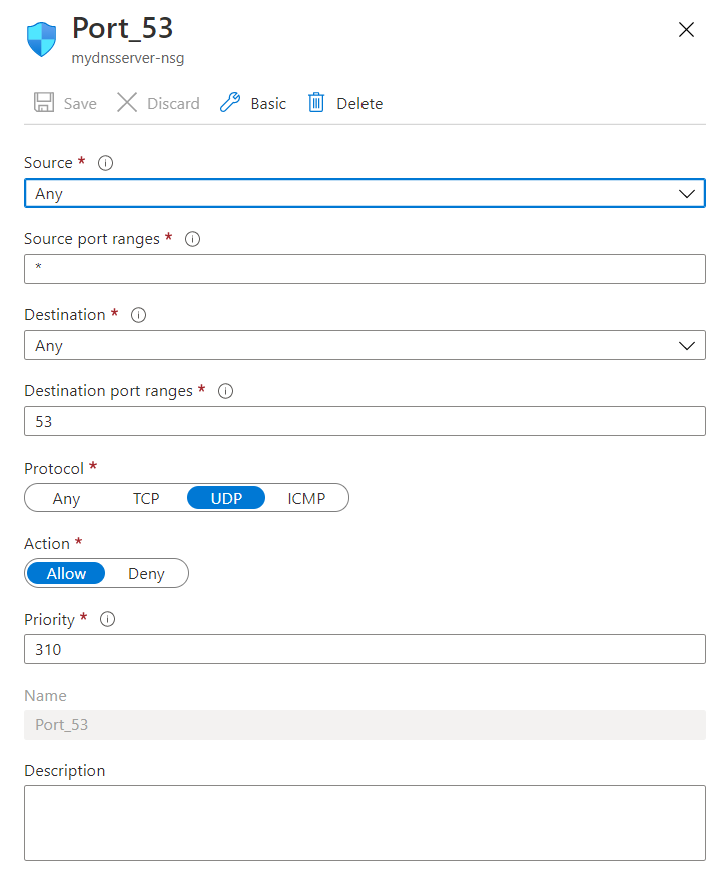

# CoreDNS Test

## Add VM (just for demo purposes!)

Install Ubuntu-18-04 LTS

192.168.0.0/24

NSG:



---

In VM:

Get IP Adress:

$ ifconfig eth0
eth0: flags=4163<UP,BROADCAST,RUNNING,MULTICAST>  mtu 1500
        inet 192.168.0.4  netmask 255.255.255.0  broadcast 192.168.0.255
        inet6 fe80::20d:3aff:fe2d:a84a  prefixlen 64  scopeid 0x20<link>
        ether 00:0d:3a:2d:a8:4a  txqueuelen 1000  (Ethernet)
        RX packets 135861  bytes 172074370 (172.0 MB)
        RX errors 0  dropped 0  overruns 0  frame 0
        TX packets 28934  bytes 4777038 (4.7 MB)
        TX errors 0  dropped 0 overruns 0  carrier 0  collisions 0

--> 192.168.0.4

Install bind9:

sudo apt-get update
sudo apt-get install bind9 bind9utils bind9-doc

IPv4 Bind mode:

sudo nano /etc/default/bind9
OPTIONS="-u bind -4"

Restart sudo systemctl restart bind9

Check:

azureuser@mydnsserver:~$ ps -ax | grep named
14810 ?        Ssl    0:00 /usr/sbin/named -f -u bind -4
14840 pts/0    S+     0:00 grep --color=auto named

/etc/bind/named.conf.options (listen on any adress - DEMO!):

```plain
options {
        directory "/var/cache/bind";

        ======================================================================$
        // If BIND logs error messages about the root key being expired,
        // you will need to update your keys.  See https://www.isc.org/bind-keys
        //======================================================================$
        dnssec-validation auto;

        auth-nxdomain no;    # conform to RFC1035
        listen-on { any; };
        listen-on-v6 { any; };
};
```

DNS Zone in /etc/bind/named.conf.local:

```plain
zone "azure.intern" {
    type master;
    file "/etc/bind/zones/db.azure.intern"; # zone file path
};
```

Create Zone file:

sudo mkdir /etc/bind/zones
sudo cp /etc/bind/db.local /etc/bind/zones/db.azure.intern

sudo nano /etc/bind/zones/db.azure.intern

```plain
;
; BIND data file for local loopback interface
;
$TTL    604800
@       IN      SOA     ns1.azure.intern. admin.azure.intern. (
                              3         ; Serial
                         604800         ; Refresh
                          86400         ; Retry
                        2419200         ; Expire
                         604800 )       ; Negative Cache TTL
;
@       IN      NS      ns1.azure.intern.
@       IN      A       127.0.0.1
@       IN      AAAA    ::1

ns1.azure.intern.       IN      A       192.168.0.4
myhost.azure.intern.    IN      A       40.112.72.205
```

Restart bind
sudo systemctl restart bind9

Check on dns server machine (redirect to localhost! Should throw no error.):

nslookup myhost.azure.intern localhost

VNET --> Add custom DNS server

Restart VM

sudo shutdown -r now

Create a test-client (optional)

- new VM
- new VNET: 192.168.1.0/24
- VNET Peering
- add Custom DNS server (private IP of DNS server, here: 192.168.0.4)

SSH into machine: 

```shell
$ nslookup myhost.azure.intern
Server:         127.0.0.53
Address:        127.0.0.53#53

Non-authoritative answer:
Name:   myhost.azure.intern
Address: 40.112.72.205
```

## How to setup CoreDNS in AKS

Add AKS cluster:

Install with Azure CNI!

Peer newly created VNET with DNS-VNET and ensure "Peering status" == "Connected"

Negative test (run a pod and lookup myhost.azure.intern - should fail!):

```shell
kubectl run --rm -it busy --image busybox /bin/sh

nslookup myhost.azure.intern
Server:         10.0.0.10
Address:        10.0.0.10:53

** server can't find myhost.azure.intern: NXDOMAIN

```

Add CoreDNS custom data:

```bash
cat << EOF | kubectl apply -f -
apiVersion: v1
kind: ConfigMap
metadata:
  name: coredns-custom
  namespace: kube-system
data:
  azure.intern.server: |
    azure.intern:53 {
        errors
        cache 30
        forward . 192.168.0.4   # 'on-prem' DNS server
    }
EOF
```

Restart DNS Pods:

kubectl delete pod --namespace kube-system --selector k8s-app=kube-dns

Positive test:

```shell
kubectl run --rm -it busy --image busybox /bin/sh

$ nslookup myhost.azure.intern
Server:         10.0.0.10
Address:        10.0.0.10:53

Name:   myhost.azure.intern
Address: 40.112.72.205

# any other DNS lookups should also work:

$ nslookup microsoft.com
Server:         10.0.0.10
Address:        10.0.0.10:53

Non-authoritative answer:
Name:   microsoft.com
Address: 40.76.4.15
Name:   microsoft.com
Address: 40.112.72.205
Name:   microsoft.com
Address: 40.113.200.201
Name:   microsoft.com
Address: 13.77.161.179
Name:   microsoft.com
Address: 104.215.148.63

```
